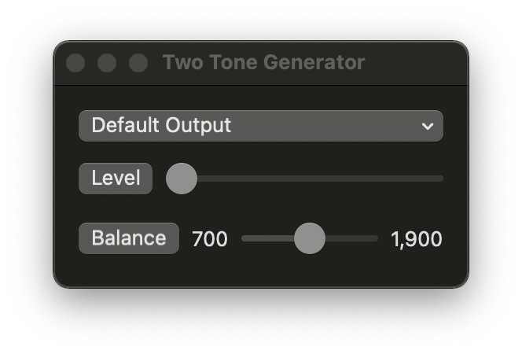
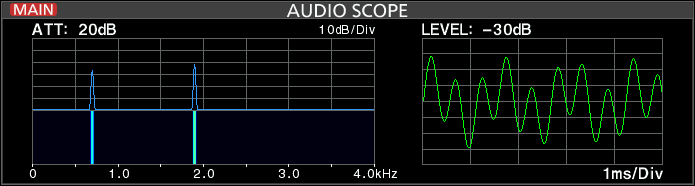

# Two Tone Generator

This program generates an audio signal consisting of two tones, 700Hz and 1900Hz.

These tones can be used to check for IMD and other distortions.

The menu button at the top, Default Output, is used to select the audio output device.

The Level slider adjusts the level of the audio output. Clicking the Level button mutes the output by setting the level to 0.

The Balance slider determines the relative ratio of the two tones. All the way to the left and only the 700 Hz is output, all the way to the right and only the 1900 Hz tone is output. Clicking the Balance button makes both tones equal.

On stereo output devices, the same signal is output to both outputs.

